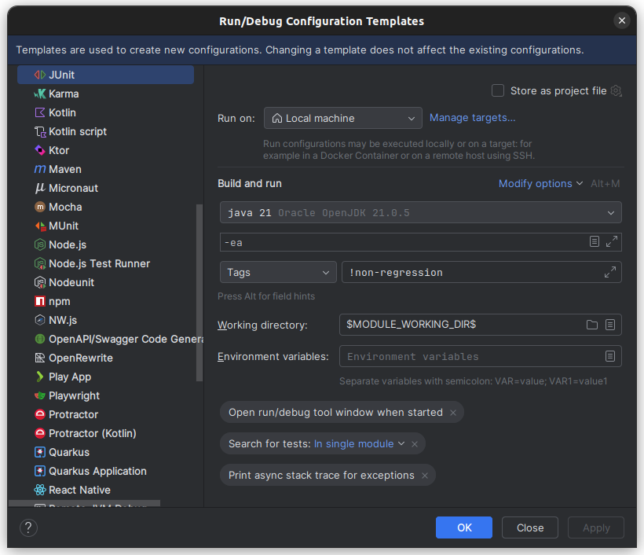

# Conventions for tests

## Unit tests

These tests are run before each push. Running all the unit tests must be relatively fast.

To test the model of a problem, you can use
the [ProblemTestBench](https://ddolib-cetic-ucl.github.io/DDOLib/javadoc/org/ddolib/util/testbench/ProblemTestBench.html).

We take the convention that each unit test on an instance must be executed in less than **5 seconds**.

Otherwise, the instance can be used in the non-regression tests.

## Non-regression tests

These tests are run each Sunday at 23h utc.

We take the convention that each test on each instance must be executed in less than **3 minutes**.
All tests on a problem must execute in at most **10 minutes**

These tests are excluded from the default `mvn test` command.

Be sure to tag you non-regression tests with `@Tag("non-regression")`.

You can run manually these tests with:

```shell
 mvn test -P non-regression-tests
```

## Running Tests in IntelliJ IDEA

By default, the `ddolib` project contains both standard unit tests (fast) and non-regression tests (potentially slow).

> [!WARNING]
> **Avoid "Run All" on the Package**
>
> If you simply right-click on the `org.ddolib` package and select **Run 'Tests in 'org.ddolib''**, IntelliJ will
> execute **ALL** tests, including the time-consuming non-regression tests.
>
> To avoid this, please use one of the methods below to run only the standard unit tests.

### How to Run Standard Tests

#### Option 1: Use the Test Suite (Recommended)

The easiest way to run the standard test set is to execute the dedicated Suite class. This class is pre-configured to
exclude non-regression tests.

1. Navigate to `src/test/java/org/ddolib/AllTests.java`.
2. Click the green **Play** button (▶) next to the class name.
3. Select **Run 'AllTests'**.

--- 

#### Option 2: Create a Custom Run Configuration

If you prefer running tests via a global Run Configuration, you can configure IntelliJ to exclude specific tags
dynamically:

1. Go to the top toolbar and select **Edit Configurations...** (or **Run > Edit Configurations...**).
2. Click the **+** button and select **JUnit**.
3. Set **Test kind** to: `Tags`.
4. Set **Tag expression** to: `!non-regression` (Note the exclamation mark for negation).
5. Click **Apply**.



You can now run this configuration anytime to execute all tests except the non-regression ones.

---

### How to Run Non-Regression Tests

If you specifically need to run the heavy validation tests :

* Run the `src/test/java/org/ddolib/NonRegressionTests.java` suite.

---

## Adding a test suite

If you want to create a specific suite of unit tests, you must exclude it from other suites for two main reasons:

1. **Avoid duplicated tests**: Prevent the `AllTests` suite from running the same tests twice.
2. **Avoid filtering errors**: Prevent the `NonRegressionTests` suite from scanning your suite class if it doesn't meet
   the expected tag criteria.

**Recommended Method:**
The most robust way to handle this in JUnit 5 is to use the `@ExcludeClassNamePatterns` annotation combined with a *
*naming convention**:

* Name your **Suites** with the plural suffix `Tests` (e.g., `AllSolversTests.java`).
* Name your **Unit Tests** with the singular suffix `Test` (e.g., `MySolverTest.java`).

In your `AllTests.java` class, add the following exclusion pattern to automatically ignore all other suites:

```java
@ExcludeClassNamePatterns({".*Tests"})