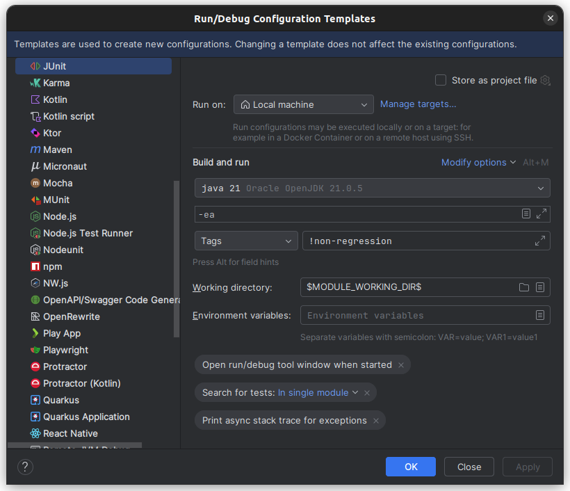

# Convention for tests

## Unit tests

These tests are run before each push. Running all the unit tests must be relatively fast.

To test the model of a problem, you can use
the [ProblemTestBench](https://ddolib-cetic-ucl.github.io/DDOLib/javadoc/org/ddolib/util/testbench/ProblemTestBench.html).

We take the convention that each unit test on an instance must be executed in less than **5 seconds**.

Otherwise, the instance can be used in the non-regression tests.

## Non-regression tests

These tests are run each Sunday at 23h utc.

We take the convention that each test on each instance must be executed in less thant **3 minutes**.

These tests are excluded from the default `mvn test` command.

Be sure to tag you non-regression tests with `@Tag("non-regression")`.

You can run manually these tests with:

```shell
 mvn test -P non-regression-tests
```

### Configure you IDE

If you are using IntelliJ IDEA to run your tests, we encourage you to disable the non-regressions tests :

Run -> Edit Configurations -> Edit Configuration Templates -> Junit

Find the `Tag` fields and add `!non-regression`. Your new configuration will exclude des non-regression tests by
default.



